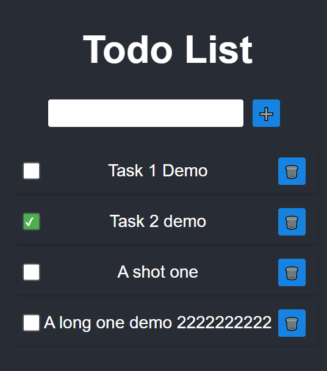
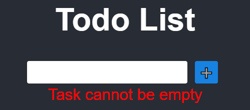

# ToDo_list_assignment

A todo list function programmed in React and TypeScript

## Add task creation/delete

* Create a new task by clicking the right side "➕" button
* Remove an existing task by clicking the task text's right side "🗑️" button

## An empty task creation is not allowed

